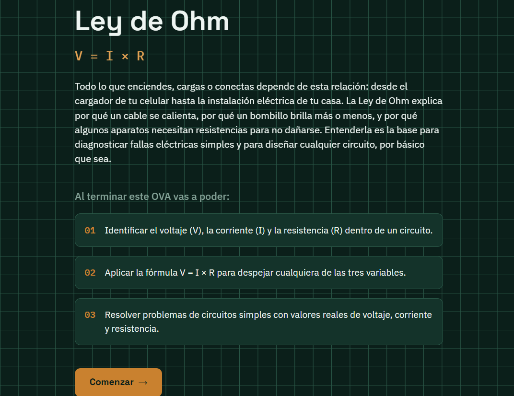
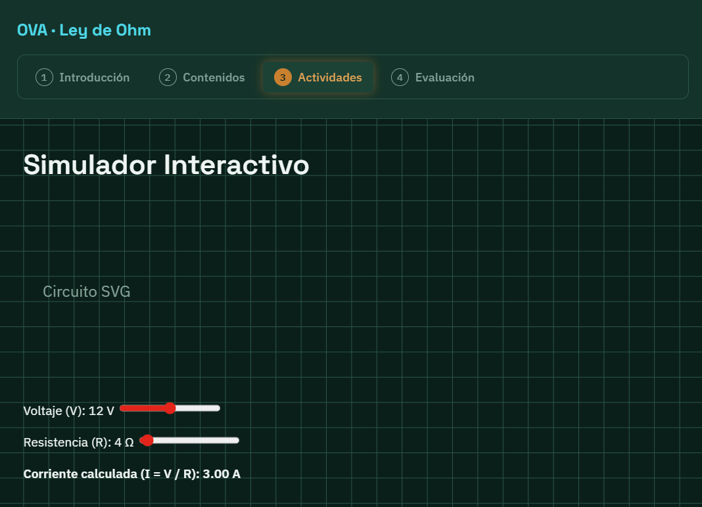
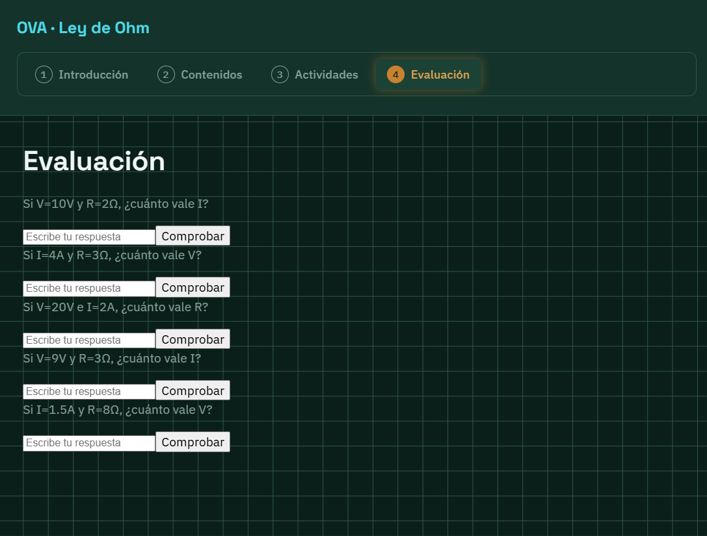
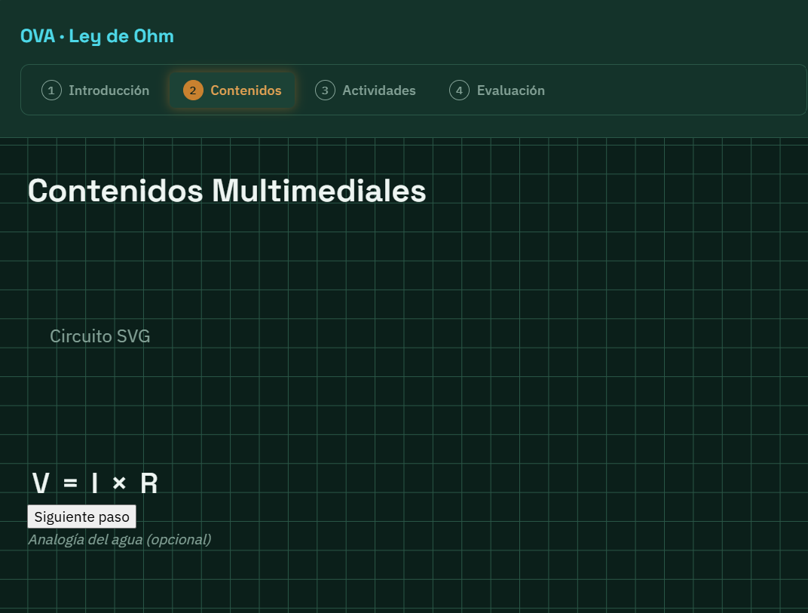
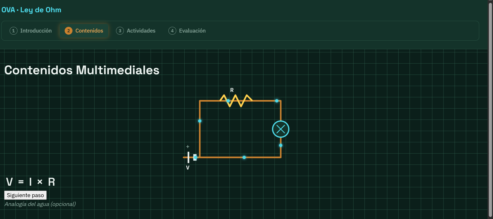

# OVA - Ley de Ohm

Objeto Virtual de Aprendizaje interactivo sobre la **Ley de Ohm** (V = I × R), desarrollado como plan de mejoramiento para la competencia de Ciencias Naturales del programa TO Análisis y Desarrollo de Software (SENA).

## Aprendiz
Nicolas

## Tema
Ley de Ohm — relación entre voltaje (V), corriente (I) y resistencia (R) en circuitos eléctricos básicos.

## Tecnologías
- Vue 3 + Vite
- Vue Router (hash history)
- SVG animado
- CSS con variables

## Cómo ejecutar el proyecto

```bash
npm install
npm run dev
```

## Estructura del proyecto

```
src/
├── main.js
├── App.vue
├── router/
│   └── index.js          # 4 rutas del OVA
├── views/                 # Los 4 pasos obligatorios
│   ├── IntroduccionView.vue
│   ├── ContenidosView.vue
│   ├── ActividadesView.vue
│   └── EvaluacionView.vue
├── components/             # Piezas reutilizables
│   ├── NavBar.vue
│   ├── CircuitoSVG.vue
│   ├── FormulaInteractiva.vue
│   ├── EjemploPasoAPaso.vue
│   ├── AnalogiaAgua.vue
│   ├── ControlesSimulador.vue
│   ├── InterruptorSwitch.vue
│   ├── GraficaVI.vue
│   ├── SobrecargaAnimacion.vue
│   ├── EjercicioNumerico.vue
│   └── ModalRetroalimentacion.vue
├── assets/                 # Imágenes, iconos
└── styles/
    ├── variables.css       # Paleta y variables globales
    └── base.css             # Reset y estilos base
```

## Capturas de pantalla











## Estado
🚧 En construcción.
