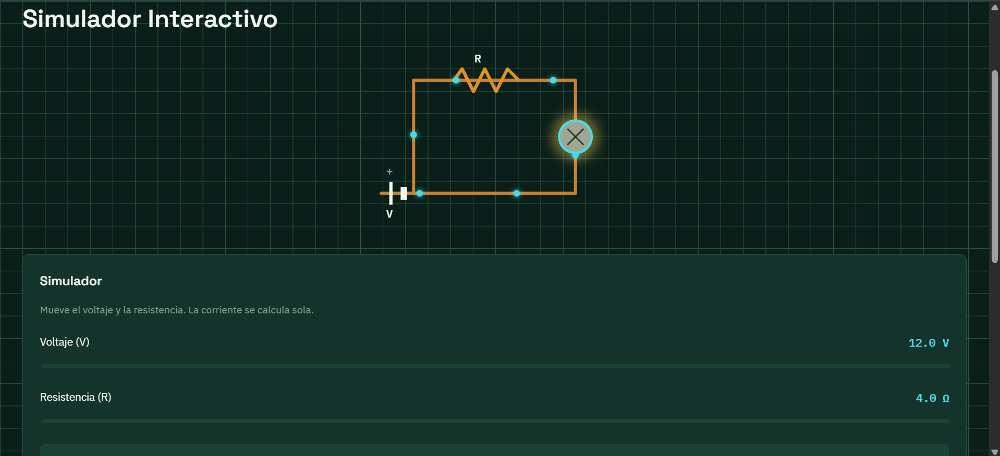
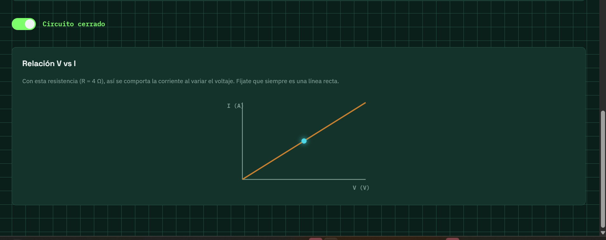
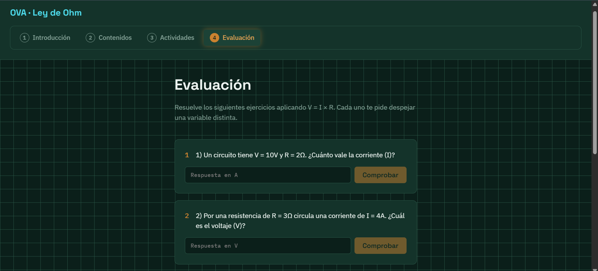
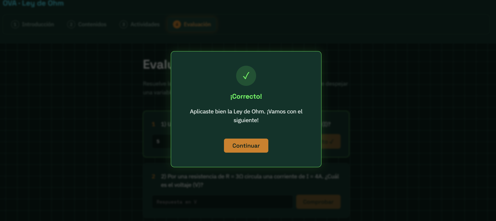
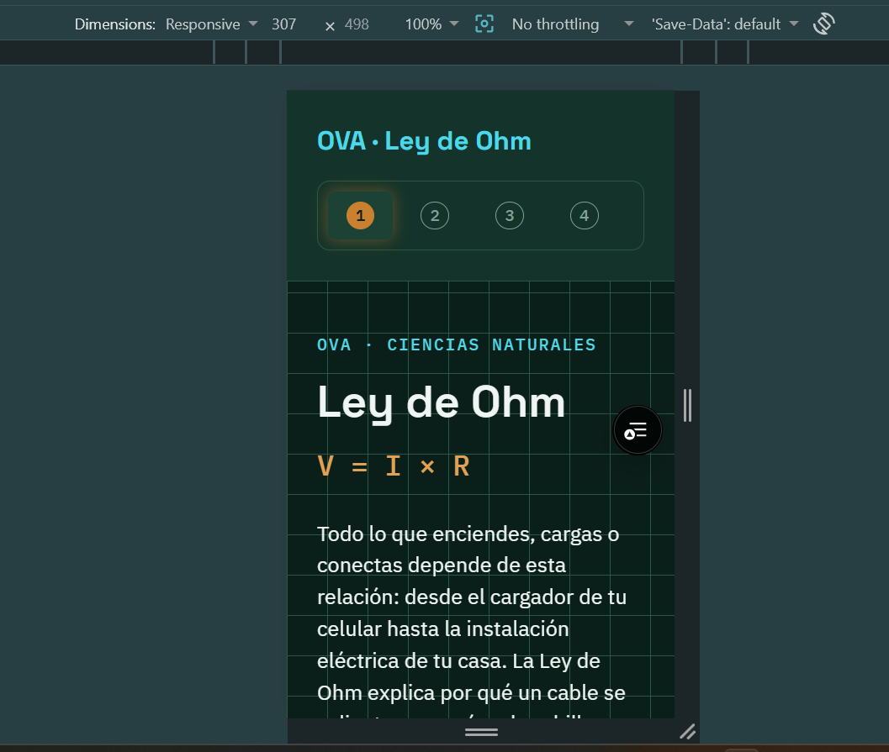

# OVA - Ley de Ohm

Objeto Virtual de Aprendizaje interactivo sobre la **Ley de Ohm** (V = I × R), desarrollado como plan de mejoramiento para la competencia de Ciencias Naturales del programa TO Análisis y Desarrollo de Software (SENA).

## Aprendiz
Nicolas

## Tema
Ley de Ohm — relación entre voltaje (V), corriente (I) y resistencia (R) en circuitos eléctricos básicos.

## Descripción
OVA interactivo con un circuito animado en SVG, un simulador donde el usuario manipula voltaje y resistencia para ver la corriente calcularse en tiempo real, una gráfica V vs I, y una evaluación con 5 ejercicios de retroalimentación inmediata.

## Tecnologías
- Vue 3 + Vite
- Vue Router (hash history)
- SVG animado
- CSS con variables

## Cómo ejecutar el proyecto localmente

\`\`\`bash
git clone https://github.com/TU_USUARIO/ova-ley-ohm.git
cd ova-ley-ohm
npm install
npm run dev
\`\`\`

Abre el navegador en la URL que indique la terminal (por defecto `http://localhost:5173`).

## Estructura del proyecto

\`\`\`
src/
├── main.js
├── App.vue
├── router/
│   └── index.js
├── views/
│   ├── IntroduccionView.vue
│   ├── ContenidosView.vue
│   ├── ActividadesView.vue
│   └── EvaluacionView.vue
├── components/
│   ├── NavBar.vue
│   ├── CircuitoSVG.vue
│   ├── FormulaInteractiva.vue
│   ├── EjemploPasoAPaso.vue
│   ├── AnalogiaAgua.vue
│   ├── ControlesSimulador.vue
│   ├── InterruptorSwitch.vue
│   ├── GraficaVI.vue
│   ├── SobrecargaAnimacion.vue
│   ├── EjercicioNumerico.vue
│   └── ModalRetroalimentacion.vue
├── assets/
└── styles/
    ├── variables.css
    └── base.css
\`\`\`

## Producción
- **Demo en vivo:** _(pega aquí tu link de Vercel/Netlify/Render una vez despliegues)_
- **Repositorio:** _(pega aquí el link de tu repo de GitHub)_

## Capturas de pantalla

## Capturas de pantalla

## Estado
🚧 En construcción.
